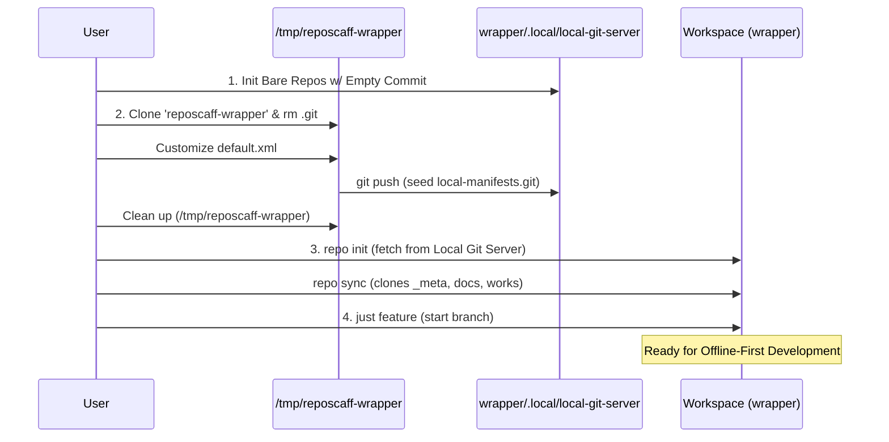

# Reposcaff Wrapper

A template repository for initializing Offline-First Monorepo Workspaces using the Google Repo Tool. This template contains the foundational configuration (`default.xml`, `justfile`) required to set up a robust, offline-capable local development environment before eventually migrating to a remote Git server.

## Overview

This repository acts as the **"seed"** for your monorepo's manifest repository. Instead of writing manifest XMLs from scratch, you clone this template, clean its Git history, customize it for your project, and push it to your local bare Git server as your `local-manifests.git`.

## Prerequisites

Ensure you have the following tools installed on your system (Linux/macOS compatible):
- **[Git](https://git-scm.com/):** Core version control system.
- **[Python 3.6+](https://www.python.org/):** Required by the Google Repo Tool and our scaffolding script.
- **[Google Repo Tool](https://gerrit.googlesource.com/git-repo/):** Used to manage multiple Git repositories.
- **[Just](https://github.com/casey/just):** A handy command runner used to execute setup and daily workflow commands.

## Proposed Structure

```text
/path/to/your/workspace/wrapper/
├── .local/
│   └── local-git-server/       <-- Acts as your local GitHub equivalent
│       ├── local-manifests.git <-- (Bare Repo) Contains Manifest (default.xml) & justfile
│       ├── local-docs.git      <-- (Bare Repo) Contains docs source code
│       ├── local-works.git     <-- (Bare Repo) Contains works source code
│       └── local-tmps.git      <-- (Bare Repo) Contains tmps source code
├── .repo/                      <-- Created by repo init. Do not manually edit or interact with this folder.
├── .agents/                    <-- Working tree for h3x-agents.git (Should exist online, or build locally then push)
├── _meta/                      <-- Working tree for local-manifests.git (Configuration)
├── docs/                       <-- Working tree for local-docs.git
├── works/                      <-- Working tree for local-works.git
├── tmps/                       <-- Working tree for local-tmps.git
├── .gitignore                  <-- Symlink automatically pointing to _meta/.gitignore
└── justfile                    <-- Symlink automatically pointing to _meta/justfile
```

- `default.xml`: The Google Repo Manifest file containing the architecture of the monorepo, pre-configured with local and remote endpoints.
- `justfile`: A command runner configuration providing unified, high-level commands (like `just sync`, `just feature`, `just push`) to manage the entire monorepo without memorizing complex `repo` commands.
- `.gitignore`: Standard gitignore tailored for the wrapper environment.

## Usage Guide (Offline-First Initialization)

### Offline-First Initialization Process



### The Quickstart, All-in-One Utility

For the fastest setup, we provide an automated scaffolding script that parses your manifest, initializes the local Git server, seeds root commits, and synchronizes the workspace in a single command.

```bash
# 1. Clone the template to a temporary directory
git clone https://github.com/thangphuocnguyen/reposcaff-wrapper.git /tmp/reposcaff-wrapper
cd /tmp/reposcaff-wrapper

# 2. Customize the manifest (Optional)
# Edit default.xml to add/remove your local_fs sub-projects

# 3. Run the scaffolding script with your target workspace absolute path
#    (Optional: Append '--force-sync' if you are rerunning and hit a sync conflict)
just -f tools/repo_scaffold.just run /path/to/your/workspace/wrapper

# 4. Start Developing
cd /path/to/your/workspace/wrapper
just feature initial-setup
```

> **What does this script do?** It parses `default.xml`, dynamically initializes a `.local/local-git-server` at your target path, injects root commits to prevent fetch errors, packages the template into `local-manifests.git`, and finally runs `repo init` and `repo sync` for you. It is highly idempotent and safe to rerun.

---

### Phase 1: Offline-First Monorepo (Manual Setup)

If you prefer to understand the inner workings or set up the environment manually, follow these detailed steps:

#### 1. Create Workspace Wrapper Directory
Before initializing the local Git server, you must create a dedicated root directory for your workspace. This directory will act as the "wrapper" that holds the local server, the configuration metadata, and all sub-projects.

```bash
mkdir -p /path/to/your/workspace/wrapper
cd /path/to/your/workspace/wrapper
```

#### 2. Initialize Local Git Server
Create the core bare repositories on your local machine inside the directory you just created. 

> **Important:** Google Repo Tool requires sub-projects to have an existing `main` branch before they can be synced. A completely empty Git repository has no branches. Therefore, we use a helper function to create an initial empty commit in each bare repository (except for `local-manifests.git`, which receives its initial commit during the Seeding step).

```bash
cd /path/to/your/workspace/wrapper
mkdir -p .local/local-git-server

# Helper function to initialize a bare repo with a root commit
init_bare() {
    REPO_PATH="$PWD/$1"
    git init --bare "$REPO_PATH"
    TMP_DIR=$(mktemp -d)
    git -C "$TMP_DIR" init
    git -C "$TMP_DIR" commit --allow-empty -m "chore: root commit for repo sync"
    git -C "$TMP_DIR" push "$REPO_PATH" HEAD:main
    rm -rf "$TMP_DIR"
}

# 1. Initialize Manifest Repo (do not use init_bare as it receives root commit from Seed)
git init --bare .local/local-git-server/local-manifests.git

# 2. Initialize Sub-projects Repo (use init_bare to seed the main branch)
init_bare .local/local-git-server/local-docs.git
init_bare .local/local-git-server/local-works.git
init_bare .local/local-git-server/local-tmps.git
```

#### 3. Clone and Seed the Wrapper Template
Download this template, clean its Git history, and customize it. Crucially, this step **pushes the seed configuration to your local Git server**, which allows the `repo` tool in the next step to successfully pull the manifest and sync all sub-projects correctly.

```bash
# Clone the template to a temporary directory
git clone https://github.com/thangphuocnguyen/reposcaff-wrapper.git /tmp/reposcaff-wrapper
cd /tmp/reposcaff-wrapper

# Remove the template's git history
rm -rf .git

# Customize the manifest (Optional)
# Edit default.xml to add/remove your sub-projects

# Initialize as your own repo and push to the local server
git init
git add .
git commit -m "chore: initial manifest architecture seeding"
git branch -M main
git remote add origin /path/to/your/workspace/wrapper/.local/local-git-server/local-manifests.git
git push -u origin main

# Clean up the temporary seeding directory (since it's already seeded to the server)
cd ..
rm -rf /tmp/reposcaff-wrapper
```

#### 4. Initialize the Workspace
Go to your intended workspace root and pull the initialized wrapper.

```bash
cd /path/to/your/workspace/wrapper

# Note: Always use an Absolute Path for local repo init to avoid detached URL issues
# Note 2: Use -b main to explicitly set the tracking branch, avoiding default branch ambiguity
repo init -u file:///path/to/your/workspace/wrapper/.local/local-git-server/local-manifests.git -b main
repo sync
```

> **Why Absolute Path?** If you configure the manifest URL using a relative path (e.g., `file://.local/local-git-server/...`), the Repo tool records this exact relative string in `.repo/manifests.git/config`. When you run `repo sync`, the tool iterates through nested subdirectories (like `docs/`). At that deeper level, the relative path context shifts and becomes incorrect. The tool will no longer be able to resolve the location of your local Git server, resulting in fetch failures. An absolute path guarantees the URL is always resolved correctly regardless of the current working directory depth.

#### 5. Start Developing
Since Repo checks out in a "Detached HEAD" state initially, start your work by creating a feature branch across all modules:

```bash
cd /path/to/your/workspace/wrapper
just feature initial-setup
```

### Phase 2: Transfer or Migrate to Online Remote Repo

Once your project is ready for collaboration or cloud backup, you can migrate your local environment to an online remote (e.g., GitHub, GitLab) with zero downtime.

#### Migrate the Wrapper Manifest to Online Remote

1. Create a new, empty repository on your remote server (e.g., `https://github.com/your-org/local-manifests.git`).
2. Push your local `local-manifests.git` to the online remote:
   ```bash
   cd /path/to/your/workspace/wrapper/.local/local-git-server/local-manifests.git
   git remote add github https://github.com/your-org/local-manifests.git
   git push --all github
   ```
3. In your workspace's `_meta` directory, edit `default.xml`. Because we use `fetch="."` (current directory relative to manifest URL), you **do not** even need to change the fetch URL! It automatically adapts to GitHub. You only need to change the `origin` remote for the manifest if you want to push updates.

#### Migrate Sub-Projects to Online Remote

From this point, you can freely migrate any other local bare repository (`local-docs.git`, `local-works.git`, etc.) to your online remote organization.

1. Create corresponding empty repositories on your remote server (e.g., `your-org/local-docs`, `your-org/local-works`).
2. Push the local bare repositories to the remote:
   ```bash
   cd /path/to/your/workspace/wrapper/.local/local-git-server/local-docs.git
   git remote add github https://github.com/your-org/local-docs.git
   git push --all github
   ```
3. Re-initialize the workspace to use the new remote URL:
   ```bash
   cd /path/to/your/workspace/wrapper
   repo init -u https://github.com/your-org/local-manifests.git -b main
   repo sync
   ```
4. Because the `default.xml` manifest uses relative fetching (`fetch="."`), the `repo` tool automatically resolves all sub-project URLs relative to the URL of the manifest repository itself. 
   - For example, when you re-initialize your workspace with `repo init -u https://github.com/your-org/local-manifests.git`, the `fetch="."` directive tells the tool that the base URL is the parent directory (`https://github.com/your-org/`). 
   - When the tool encounters `<project name="local-docs.git" ...>`, it seamlessly combines them to form `https://github.com/your-org/local-docs.git`.
   - This architectural design means **you do not need to modify the `default.xml` file during migration!** The manifest dynamically adapts to wherever it is hosted.
   - Once your entire workspace is successfully synced with the new online remote, the offline environment is no longer needed, and you can safely delete the `.local/local-git-server` directory to reclaim disk space.

## Available Just Commands

- `just status`: View detailed status of all modules.
- `just feature <name>`: Create and checkout a new branch across all modules.
- `just sync`: Sync the project according to the manifest.
- `just checkout`: Force detach and reset all modules to the manifest revision.
- `just push`: Push all active branches to their respective remotes.
- `just clean`: Remove untracked files across the entire project.
